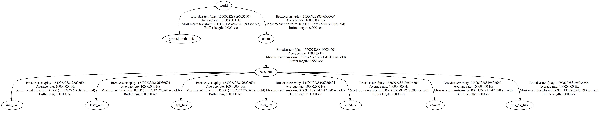

# NCLT2ROS

With [nclt2ros](https://github.com/bierschi/nclt2rosbag) it is possible to

- [download](https://github.com/bierschi/nclt2rosbag#downloadlaunch)
- [extract](https://github.com/bierschi/nclt2rosbag#downloadlaunch)
- [visualize](https://github.com/bierschi/nclt2rosbag#visualizelaunch)
- [convert](https://github.com/bierschi/nclt2rosbag#convertlaunch)

the data from [The University of Michigan North Campus Long-Term Vision and LIDAR Dataset.](http://robots.engin.umich.edu/nclt/)


#### Table of contents:

- [Launch files](https://github.com/bierschi/nclt2ros#launch-files)
- [Usage](https://github.com/bierschi/nclt2ros#usage)
- [Examples](https://github.com/bierschi/nclt2ros#examples)
- [Transformation tree](https://github.com/bierschi/nclt2ros#transformation-tree)


## Launch files

##### download.launch
launch file for downloading the raw data

```xml
<launch>
    # download
    <node name="nclt2ros" pkg="nclt2ros"  type="nclt2downloader" output="screen">
    
        <param name="date"          value="2013-01-10" />
        <param name="raw_data_path" value="/home/christian/nclt2ros/raw_data" />
        
        <param name="lb3"           value="False" />
        <param name="sen"           value="True" />
        <param name="vel"           value="False" />
        <param name="hokuyo"        value="False" />
        <param name="gt"            value="True" />
        <param name="gt_cov"        value="True" />
        
    </node>
</launch>
```

downloads the `sen` (sensor data), `gt` (ground truth) and `gt_cov` (ground truth covariance) from date `2013-01-10` in folder `/home/christian/nclt2ros/raw_data`


##### visualize.launch
launch file for visualizing specific data

```xml
<launch>
    # visualize
    <node name="nclt2ros" pkg="nclt2ros"  type="nclt2visualizer" output="screen">
    
        <param name="date"          value="2013-01-10"/>
        <param name="raw_data_path" value="/home/christian/nclt2ros/raw_data" />
        <param name="plot_path"     value="/home/christian/nclt2ros/plots" />
        
        <param name="gt_kml"        value="False" />
        <param name="gt_png"        value="True" />
        <param name="gps_kml"       value="False" />
        <param name="gps_png"       value="False" />
        <param name="gps_rtk_kml"   value="True" />
        <param name="gps_rtk_png"   value="True" />
        <param name="odom_kml"      value="False" />
        <param name="odom_png"      value="True" />
        <param name="all"           value="False" />
        
    </node>
</launch>
```

visualizes the `gt_png`, `gps_rtk_kml`, `gps_rtk_png` and `odom_png` from date `2013-01-10` with raw data in `/home/christian/nclt2ros/raw_data` and places the plots in `/home/christian/nclt2ros/plots`

##### convert.launch
launch file for converting the raw data to rosbag files

```xml
<launch>
    # download
    <node name="nclt2ros" pkg="nclt2ros"  type="nclt2rosbag" output="screen">
    
        <param name="date"                value="2013-01-10"/>
        <param name="raw_data_path"       value="/home/christian/nclt2ros/raw_data" />
        <param name="rosbag_output_path"  value="/home/christian/nclt2ros/rosbags"/>
        <param name="bag_name"            value="nclt" />
        <param name="cam_folder"          value="5"/>
        
        # specify data to convert
        <param name="lb3"                 value="False" />
        <param name="sen"                 value="True" />
        <param name="vel"                 value="True" />
        <param name="hokuyo"              value="True" />
        <param name="gt"                  value="True" />
        
        # topic names
        <param name="gps_fix"             value="/navsat/fix" />
        <param name="gps_track"           value="/navsat/track" />
        <param name="gps__speed"          value="/navsat/speed" />
        <param name="gps_rtk_fix"         value="/navsat/rtk/fix" />
        <param name="gps_rtk_track"       value="/navsat/rtk/track" />
        <param name="gps_rtk_speed"       value="/navsat/rtk/speed" />
        <param name="ms25_imu_data"       value="/imu/data" />
        <param name="ms25_imu_mag"        value="/imu/mag" />
        <param name="wheel_odometry"      value="/odom" />
        <param name="hokuyo_utm_lidar"    value="/hokuyo_30m" />
        <param name="hokuyo_urg_lidar"    value="/hokuyo_4m" />
        <param name="velodyne_lidar"      value="/velodyne_points" />
        <param name="ladybug_sensor"      value="/images/raw" />
        <param name="ground_truth"        value="/ground_truth" />
        
        # frame ids
        <param name="gps_sensor"          value="gps_link" />
        <param name="gps_rtk_sensor"      value="gps_rtk_link" />
        <param name="imu_sensor"          value="imu_link" />
        <param name="wheel_odometry"      value="odom" />
        <param name="hokuyo_utm_lidar"    value="laser_utm" />
        <param name="hokuyo_urg_lidar"    value="laser_urg" />
        <param name="velodyne_lidar"      value="velodyne" />
        <param name="ladybug_sensor"      value="camera" />
        <param name="ground_truth"        value="ground_truth_link" />
        <param name="body"                value="base_link" />
        
    </node>
</launch>
```


## Usage

create a catkin workspace
<pre><code>
mkdir -p ~/catkin_ws/src<br>
cd ~/catkin_ws/<br>
catkin_make <br>
source devel/setup.bash
</pre></code>

download and build this repository
<pre><code>
cd src <br>
git clone https://github.com/bierschi/nclt2ros.git <br>
cd ~/catkin_ws/ <br>
catkin_make
</pre></code>

source the catkin workspace to access the package nclt2ros
<pre><code>
source devel/setup.bash
</pre></code>

execute specific roslaunch file 
<pre><code>
roslaunch nclt2ros download.launch
</pre></code>


## Examples

<pre><code>
./nclt2rosbag.py visualize 2013-01-10 --all
</pre></code>

<div align="left">
  <br>
  
</div>

<br>
visualized all data as a kml file:

<div align="left">
  <br>
  
</div>


## Transformation Tree
change `frame_id` and `topic_name` in launch file `convert.launch`

<div align="left">
  <br>
  
</div>