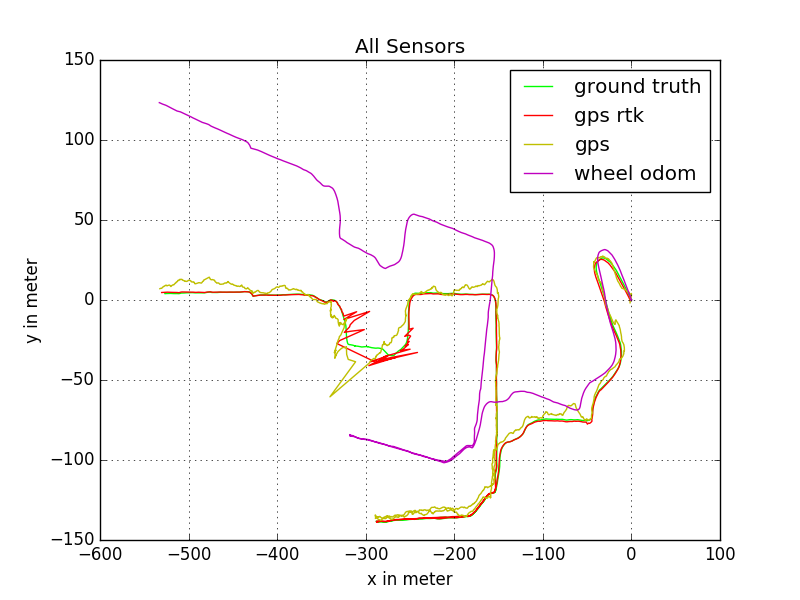
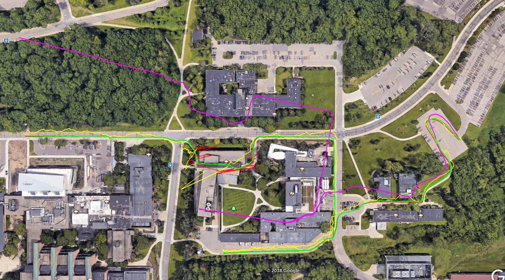

# NCLT2ROSBAG

With [nclt2rosbag](https://github.com/bierschi/nclt2rosbag) it is possible to

- [download](https://github.com/bierschi/nclt2rosbag#download)
- [extract](https://github.com/bierschi/nclt2rosbag#extract)
- [convert](https://github.com/bierschi/nclt2rosbag#convert)
- [visualize](https://github.com/bierschi/nclt2rosbag#visualize)

the data from [The University of Michigan North Campus Long-Term Vision and LIDAR Dataset.](http://robots.engin.umich.edu/nclt/)

#### Table of Contents:

- [Usage](https://github.com/bierschi/nclt2rosbag#usage)
- [Examples](https://github.com/bierschi/nclt2rosbag#examples)
- [Transformation tree](https://github.com/bierschi/nclt2rosbag#transformation-tree)

## Usage
download and build this repository
<pre><code>
git clone https://github.com/bierschi/nclt2rosbag.git  
cd nclt2rosbag  
sudo python setup.py install
</pre></code>

make the script <code>nclt2ros.py</code> executable
<pre><code>
chmod +x nclt2rosbag.py
</pre></code>

#### general structure

<pre><code>
./nclt2rosbag.py action date  
download &nbsp;&nbsp;&nbsp;: --lb3 --sen --vel --hokuyo --gt --gt_cov  
visualize&nbsp;&nbsp;&nbsp: --gt_kml --gt_png --gps_kml --gps_png --gps_rtk_kml --gps_rtk_png --odom_kml --odom_png --all  
convert&nbsp;&nbsp;&nbsp;&nbsp;&nbsp: --lb3 --sen --vel --hokuyo --gt --bag --cam_folder
</pre></code>
 
The positional arguments <code>action</code> and <code>date</code> are mandatory. Indicate an action command (download, extract, convert, visualize). 
Define also a date from the dataset. The additional commands for download, visualize and convert are optional arguments.

#### download

<pre><code>
./nclt2rosbag.py download 2013-01-10 --gt --gt_cov --sen --hokuyo --vel
</pre></code>
Downloads the <code>Ground Truth Pose</code>, <code>Ground Truth Covariance</code>, <code>Sensors</code>, 
<code>Hokuyo</code> and the <code>Velodyne</code> data from date <code>2013-01-10</code>.

#### extract

<pre><code>
./nclt2rosbag.py extract 2013-01-10
</pre></code>
Extracts the hokuyo, images, sensors and velodyne tarballs , if available, in folder date named <code>2013-01-10</code>

#### convert

<pre><code>
./nclt2rosbag.py convert 2013-01-10 --bag nclt --cam_folder 5
</pre></code>
Converts the dataset from <code>2013-01-10</code> in bag file <code>nclt.bag</code>, containing only images from cam folder 5 

#### visualize

<pre><code>
./nclt2rosbag.py visualize 2013-01-10 --gt_kml
</pre></code>
Visualizes the ground truth from date 2013-01-10 as a kml file 

## Examples

<pre><code>
./nclt2rosbag.py visualize 2013-01-10 --all
</pre></code>

   
  

 
visualized all data as a kml file:

   
  

## Transformation Tree
<code>frame_id</code> and <code>topic_name</code> can be changed with the json configuration file 
<code>configuration.json</code> in folder <code>/cfg</code>

   
  

